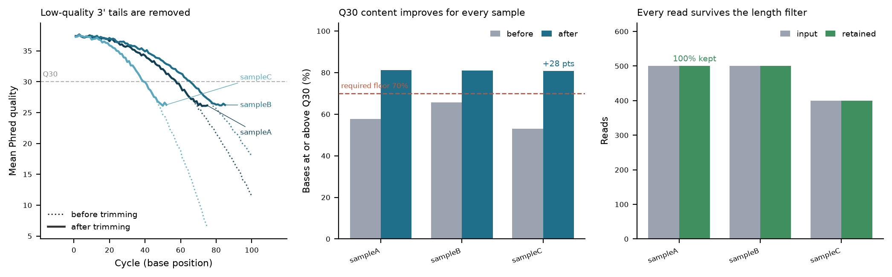

# nf-fastq-qc

A small, reproducible Nextflow DSL2 pipeline for short-read FASTQ quality
control and trimming — with a **hard validation gate** that stops the run if
trimming did not actually improve the data.

Most QC pipelines produce a report whether or not the numbers make sense. This
one refuses to: the `VALIDATE_QC` step asserts a set of invariants and exits
non-zero on violation, so a report only exists when the results are defensible.

---

## What it does

```
samplesheet.csv
      |
      +-- QC_RAW ---------------------+
      |                               |
      +-- FASTQ_TRIM --> QC_TRIMMED --+
                    |                 |
                    +--> MERGE_* -----+--> VALIDATE_QC  (hard gate)
                                              |
                                              +--> PLOT_QC --> MAKE_REPORT
```

| Step | What it does |
|---|---|
| `FASTQ_QC` | Per-cycle quality, %Q20/%Q30, GC, read-length and ambiguous-base metrics |
| `FASTQ_TRIM` | Mismatch-tolerant adapter removal, running-sum 3' quality trimming, length filter |
| `MERGE_TSV` | Deterministic (sample-sorted) merge of per-sample tables |
| `VALIDATE_QC` | Asserts QC invariants; **exits non-zero on violation** |
| `PLOT_QC` | Three-panel summary figure |
| `MAKE_REPORT` | Markdown report with tables, figure and a methods paragraph |

## Quick start

```bash
# Runs on bundled synthetic test data, no downloads, no containers required.
nextflow run . -profile test --outdir results_test
```

Real data:

```bash
nextflow run . \
    --input samplesheet.csv \
    --outdir results \
    --quality_cutoff 25 \
    --min_length 30
```

`samplesheet.csv`:

```csv
sample,fastq
sampleA,/path/to/sampleA_R1.fastq.gz
sampleB,/path/to/sampleB_R1.fastq.gz
```

### Parameters

| Parameter | Default | Meaning |
|---|---|---|
| `--input` | — | Samplesheet CSV (`sample,fastq`) |
| `--outdir` | `results` | Output directory |
| `--quality_cutoff` | `20` | Phred cutoff for 3' running-sum trimming |
| `--min_length` | `25` | Discard reads shorter than this after trimming |
| `--adapter` | `AGATCGGAAGAGC` | Adapter prefix to remove (Illumina TruSeq universal) |
| `--min_q30_after` | `70.0` | Validation floor: trimmed %Q30 must be at least this |

### Profiles

| Profile | Use |
|---|---|
| `test` | Bundled synthetic data, local executor |
| `conda` | Resolve `environment.yml` per process |
| `docker` | Containerised execution |

## The validation gate

`bin/validate_qc.py` is the pipeline's positive control. It fails the run if:

- trimming produced **more** reads or bases than it consumed (impossible — indicates a bug or a file mix-up);
- mean quality or %Q30 **decreased** after trimming;
- trimmed %Q30 is below `--min_q30_after`;
- the trim logs do not reconcile with the QC read counts.

Failure looks like this — note that `PLOT_QC` and `MAKE_REPORT` never run:

```
VALIDATION FAILED:
    [sampleB] trimmed pct_q30 69.8669 below required floor 70.0
```

That output is real: it is what this repository produced with
`--quality_cutoff 20` on the bundled test data, saved in
`assets/gate_failure_demo.txt`. Raising the cutoff to 25 clears the floor
legitimately, by trimming more aggressively — not by lowering the threshold.

## Example output



Left: per-cycle mean quality before (dotted) and after (solid) trimming.
Middle: %Q30 before and after, with the validation floor drawn.
Right: read retention through the length filter.

Trimming raised %Q30 by 15.5 to 27.8 percentage points across the three test
samples while retaining 100% of reads.

## Tests

```bash
pytest tests/ -q     # 42 unit tests, no network, no external tools
```

The suite covers FASTQ parsing and its structural rejections, Phred conversion,
metric arithmetic (including ambiguous-base exclusion and ragged read lengths),
adapter matching under mismatch and overlap limits, quality-trimming behaviour,
output determinism, and every failure mode of the validation gate.

## Design notes

- **No external tools.** `bin/*.py` uses only the Python standard library
  (matplotlib for the figure). The pipeline runs on a laptop with no internet.
- **Deterministic.** Repeated runs on identical input produce byte-identical
  output; merges are sample-sorted rather than task-completion ordered.
- **Fails loudly.** Malformed FASTQ records raise rather than being silently
  skipped; a truncated record is a data problem, not something to swallow.
- **Same code both sides.** Raw and trimmed reads are measured by the identical
  QC implementation, so before/after numbers are directly comparable.

## Limitations

- Single-end reads only. Paired-end support requires read-pair-aware trimming.
- Adapter removal matches one 3' adapter prefix; it is not a full alignment-based
  adapter detector such as cutadapt.
- The QC implementation is written for clarity and portability, not throughput.
  For production-scale cohorts use fastp/FastQC with MultiQC; the value here is
  the validation gate pattern and the reproducibility guarantees.

## Author

Tilak Sharma — M.Sc. Botany, University of Kota · bioinformatics and workflow development
